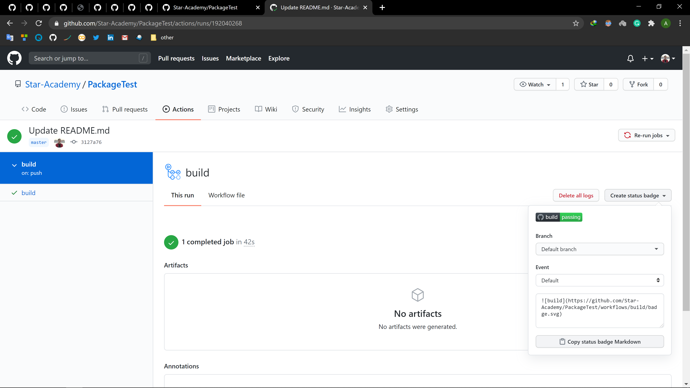
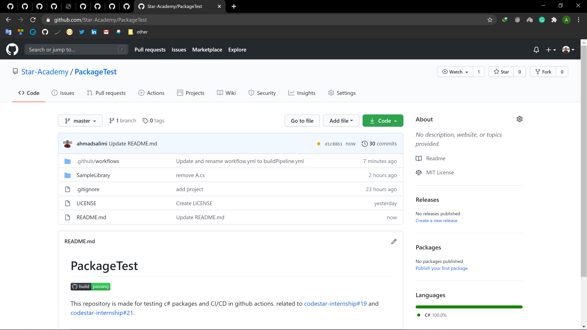

<div dir="rtl" align='justify'>

[لیست تسک‌های مرتبط با این فاز به صورت issue template](./issue-template-Phase06.md)

#  فاز شش: CI/CD

در این فاز با مفهوم CI/CD
و اهمیت استفاده از آن آشنا خواهید شد. همچنین پروژهٔ خود را به CI/CD
مجهز می‌کنید.

1. CI/CD چیست و چرا اهمیت دارد:

    در این مرحله، در مورد مفهوم CI/CD
    و اهمیت آن مطالعه کنید. در این بخش، مطالعه‌ی لینک‌های زیر پیشنهاد می‌شود.

    <div dir="ltr">

    - [What is CI/CD?](https://medium.com/tilicholabs/what-is-ci-cd-c7c047b80e6b)
    - [What’s the Point of CI Anyway?](https://medium.com/swlh/whats-the-point-of-ci-anyway-ac3f9eaa244c)
    - [The Journey to CI/CD](https://medium.com/driven-by-code/the-journey-to-ci-cd-b1872927c36b)

    </div>

1. آشنایی با GitHub Actions و اضافه کردن CI/CD Pipeline به ریپازیتوری:

    یکی از ابزار CI/CD
    معروف، GitHub Actions
    است که به کمک آن، می‌توانیم یک Pipeline
    شامل عملیات build،
    اجرای unit test
    ها و همچنین انتشار package
    و دیگر عملیاتی که در دستهٔ CI/CD
    می‌گنجد را به ریپازیتوری گیت‌هاب خود اضافه کنیم. این بخش شامل مراحل زیر است:

    1. فایل زیر را در مسیر زیر در ریپازیتوری خود می‌سازیم:

        <div dir="ltr">

        ```
        .github/workflows/buildPipeline.yml
        ```

        </div>

    1. برای pipeline خود یک نام تعریف می‌کنیم: (به فایل `buildPipeline.yml` اضافه کنید.)

        <div dir="ltr">

        ```yml
        name: build
        ```

        </div>

    1. مشخص می‌کنیم که pipeline در هنگام push و pull request روی master اجرا شود.

        <div dir="ltr">

        ```yml
        on:
          push:
            branches: [ master ]
          pull_request:
            branches: [ master ]
        ```

        </div>

    
    1. مراحل Pipeline را به ترتیب تعریف می‌کنیم. در ابتدا مشخص می‌کنیم که pipeline روی آخرین ورژن ubuntu اجرا شود: (می‌توان آن را تغییر داد)

        <div dir="ltr">

        ```yml
        jobs:
          build:
            runs-on: ubuntu-latest
        ```

        </div>
    
    1. در این مرحله مشخص می‌کنیم که CI از agent ای به نام `actions/checkout@v2` استفاده کند: (برای مطالعه بیشتر [این](https://www.edwardthomson.com/blog/) لینک را بخوانید.)

        <div dir="ltr">

        ```yml
            steps:
            - uses: actions/checkout@v2
        ```

        </div>
    
    1. در این مرحله مشخص می‌کنیم که .Net core 3.1 نصب شود.

        <div dir="ltr">

        ```yml
            - name: Setup .NET Core
              uses: actions/setup-dotnet@v1
              with:
                dotnet-version: 3.1.301
        ```

        </div>
    
    1. سپس dependency های پروژه restore شوند:‌ (دقت کنید که به جای `<path to solution>` آدرس فولدر solution خود را مشخص کنید.)

        <div dir="ltr">

        ```yml
            - name: Install dependencies
              run: dotnet restore
              working-directory: <path to solution>
        ```

        </div>
    
    1. solution را build می‌کنیم.

        <div dir="ltr">

        ```yml
            - name: Build
              run: dotnet build --configuration Release --no-restore
              working-directory: <path to solution>
        ```

        </div>
    
    1. تست‌ها را run می‌کنیم.

        <div dir="ltr">

        ```yml
            - name: Test
              run: dotnet test --no-restore --verbosity normal --collect:"XPlat Code Coverage"
              working-directory: <path to solution>
        ```

        </div>
    
        تبریک! CI
        شما آماده‌است. فایل را commit
        کرده و روی master
        پوش کنید.

        در ریپازیتوری خود وارد منوی Actions
        شوید؛ همانطور که مشاهده می‌کنید، Pipeline
        شما در حال اجرا است:
        
        

        آن را باز کرده و وارد بخش build
        شوید:

        

    1. افزودن badge وضعیت CI به README:

        از این قسمت دکمهٔ Copy status badge Markdown
        را انتخاب کرده و متن کپی‌شده را به README
        ریپازیتوری خود اضافه کنید.

        

        می‌توانید وضعیت Pipeline
        را در هر لحظه مشاهده کنید:

        
    
    1. افزودن مشاهده وضعیت code coverage:

        با اکانت GitHub
        خود در سایت [codecov.io](https://codecov.io)
        وارد شوید. سپس به این آدرس بروید:

        <div dir="ltr">

        ```
        https://codecov.io/gh/Star-Academy/<your-repository-name>
        ```

        </div>
    
    1. بخش زیر را به فایل `buildPipeline.yml` اضافه کنید:

        <div dir="ltr">

        ```yml
            - name: Publish code coverage reports to codecove.io
              uses: codecov/codecov-action@v1
              with:
                token: ${{ secrets.CODECOV_TOKEN }}
                files: ./**/coverage.cobertura.xml
                fail_ci_if_error: true
        ```

        </div>
    
    1. یک‌بار دیگر صفحهٔ زیر را باز کنید:

        <div dir="ltr">

        ```
        https://codecov.io/gh/Star-Academy/<your-repository-name>
        ```

        </div>

        وارد بخش Setting
        شده و از سمت چپ، گزینه‌ی Badge
        را انتخاب کنید. در صفحه‌ای که باز می‌شود، Markdown
        را کپی کرده و در README
        ریپازیتوری خود قرار دهید. اکنون مشاهده خواهید کرد که در هر لحظه، وضعیت code coverage
        شما نیز نمایش داده می‌شود:

        

        تا به اینجای کار، کل فایل `buildPipeline.yml`
        باید بصورت زیر باشد:

        <div dir="ltr">

        ```yml
        name: build

        on:
          push:
            branches: [ master ]
          pull_request:
            branches: [ master ]
        
        jobs:
          build:
            runs-on: ubuntu-latest

            steps:
            - uses: actions/checkout@v2

            - name: Setup .NET Core
              uses: actions/setup-dotnet@v1
              with:
                dotnet-version: 3.1.301
            
            - name: Install dependencies
              run: dotnet restore
              working-directory: <path to solution>

            - name: Build
              run: dotnet build --configuration Release --no-restore
              working-directory: <path to solution>

            - name: Test
              run: dotnet test --no-restore --verbosity normal --collect:"XPlat Code Coverage"
              working-directory: <path to solution>

            - name: Publish code coverage reports to codecove.io
              uses: codecov/codecov-action@v1
              with:
                token: ${{ secrets.CODECOV_TOKEN }}
                files: ./**/coverage.cobertura.xml
                fail_ci_if_error: true
        ```

        </div>

    
    1. انتشار package در [NuGet.org](https://nuget.org):

        NuGet،
        پکیج منیجر معروف مایکروسافت برای انتشار پکیج‌های Net.
        است. برای کسب اطلاعات بیشتر،
        [این](https://docs.microsoft.com/en-us/nuget/what-is-nuget)
        لینک را مطالعه کنید. در این مرحله، می‌خواهیم یک Pipeline
        جدید بسازیم که هنگام release
        یک ورژن در ریپازیتوری، پکیج را در [NuGet.org](https://nuget.org)
        منتشر کند.

        ابتدا باید مشخصات package
        را در فایل `csproj.`
        مربوط به پروژهٔ خود مشخص کنید. بدین منظور، این فایل باید به صورت زیر باشد:
        (توجه کنید که در این فایل، به جای `[TeamNumber]`
        شمارهٔ تیم خود و به جای `[LibraryName]`
        نام پروژهٔ خود را قرار دهید. شماره تیم به این خاطر باید قرار داده شود که اگر نام پروژه دو تیم یکسان بود، publish
        دچار مشکل نشود و در نهایت `PackageId`
        یکتا باشد.)

        <div dir="ltr">

        ```xml
        <Project Sdk="Microsoft.NET.Sdk">

            <PropertyGroup>
                <TargetFramework>netstandard2.0</TargetFramework>
                <PackageId>StarAcademy.Team[TeamNumber].[LibraryName]</PackageId>
                <Authors>[TeamMembers]</Authors>
                <Company>Star Academy</Company>
            </PropertyGroup>

        </Project>
        ```

        </div>
        
        در ادامه، برای ساخت Pipline
        مربوط به publish،
        فایل زیر را می‌سازیم:

        <div dir="ltr">

        ```
        .github/workflows/publishPipeline.yml
        ```

        </div>

        سپس مراحل زیر را به آن اضافه می‌کنیم:

        - نام، trigger
        و OS
        مربوط به pipeline
        را مشخص می‌کنیم.

        <div dir="ltr">

        ```yml
        name: publish

        on:
          release:
            types:
              published

        jobs:
          publish:
            runs-on: ubuntu-latest

        ```

        </div>
        
        - نصب .Net Core:

        <div dir="ltr">

        ```yml
            steps:
            - uses: actions/checkout@v2

            - name: Setup .NET Core
              uses: actions/setup-dotnet@v1
              with:
                dotnet-version: 3.1.301
        ```

        </div>
        
        - گرفتن ورژن release
        کنونی. توجه کنید که تگ release
        بعنوان ورژن به NuGet
        داده می‌شود. در نتیجه، الگوهای قابل قبول ورژن را از
        [اینجا](https://docs.microsoft.com/en-us/nuget/concepts/package-versioning)
        بخوانید و تگ را مطابق این الگو بزنید.
        (به جای `<repository name>`
        نام ریپازیتوری خود را قرار دهید.)

        <div dir="ltr">

        ```yml
            - name: Get current release version
              id: version
              uses: pozetroninc/github-action-get-latest-release@master
              with:
                repository: Star-Academy/<repository name>
        ```

        </div>

        - build و ساخت پکیج NuGet
        (به جای `<path to classlib project>`
        آدرس فولدری را که فایل `csproj.`
        مربوط به پروژه class library
        در آن قرار دارد بنویسید.)

        <div dir="ltr">

        ```yml
            - name: Build library and generate NuGet Package
              run: dotnet pack -c Release -o artifacts -p:PackageVersion=${{ steps.version.outputs.release }}
              working-directory: <path to classlib project>
        ```

        </div>

        - انتشار پکیج NuGet

        <div dir="ltr">

        ```yml
            - name: Publish NuGet Package
              run: dotnet nuget push ./**/*.nupkg -k ${{ secrets.NUGET_API_KEY }} -s https://api.nuget.org/v3/index.json
        ```

        </div>

        از این پس، هر گاه در ریپازیتوری خود تگ بزنید، Pipeline
        فوق trigger
        می‌شود و در نتیجه پکیج شما push
        می‌شود. همچنین در منوی Actions
        می‌توانید وضعیت publish
        را مشاهده کنید. پکیج منتشر شدهٔ خود را نیز می‌توانید در آدرس زیر مشاهده کنید:
        
        <div dir="ltr">

        ```
        nuget.org/packages/[PackageId]
        ```

        </div>
    
    همچنین نمونه فایل‌های pipeline
    ها و یک پروژه class library
    و xunit
    نمونه، در
    [این ریپازیتوری](https://github.com/Star-Academy/PackageTest)
    موجود می‌باشد.

1. ساخت یک Console App برای پروژه سرچ

    در این بخش، یک solution
    دیگر بسازید، و در آن با dotnet cli
    یک console app
    بسازید. در پوشه پروژه کنسول، command
    زیر را اجرا کنید تا پکیج سرچ شما به پروژه کنسول اضافه شود:

    <div dir="ltr">

    ```
    dotnet add package [packageId]
    ```

    </div>

    با این command،
    پکیج به پروژه شما اضافه می‌شود و می‌توانید از کلاس‌های آن استفاده کنید. همچنین اگر پکیج خود را update
    کرده باشید، با اجرای این command،
    نسخه جدید پکیج به پروژه شما اضافه می‌شود.

    حال با استفاده از پکیج کتابخانه سرچ‌تان، یک نرم‌افزار سرچ تحت کنسول پیاده‌سازی کنید.

</div>
